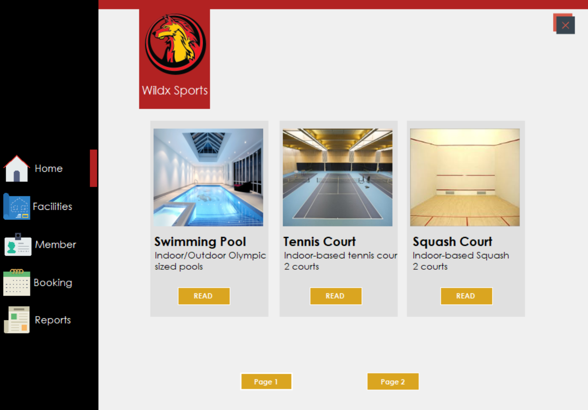
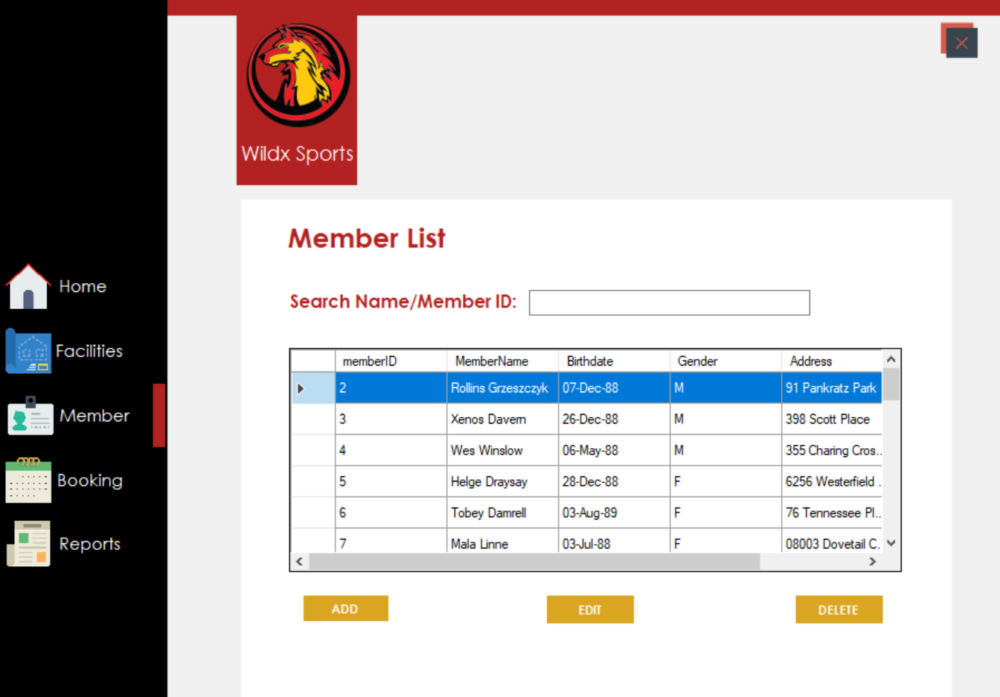
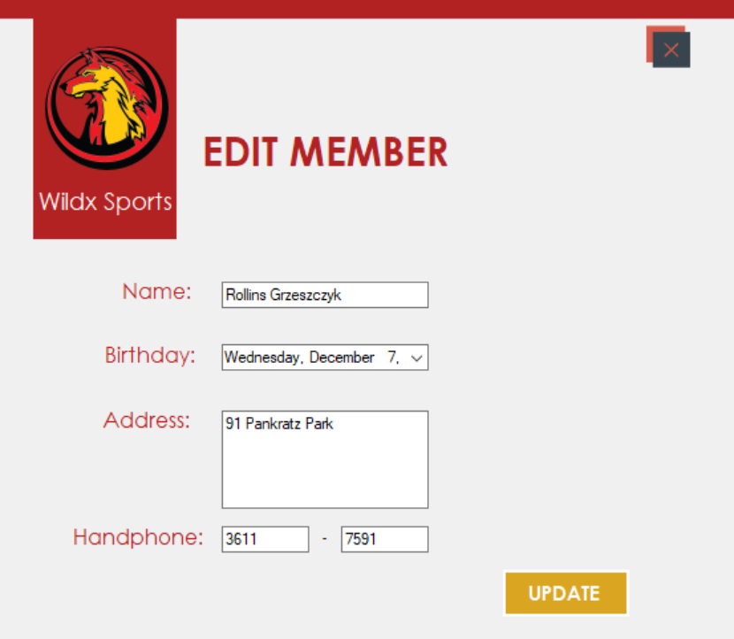
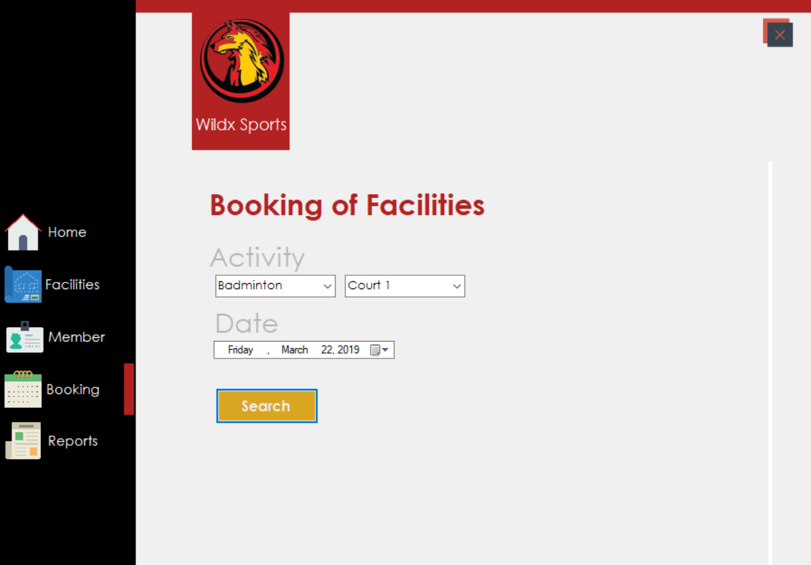
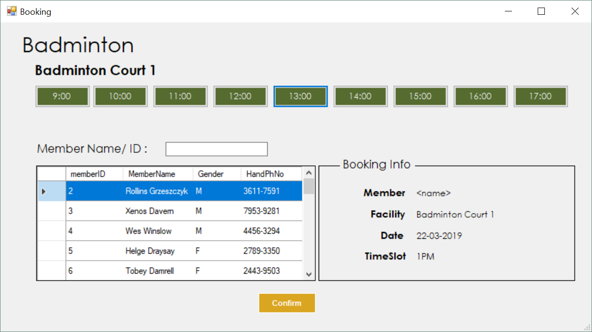
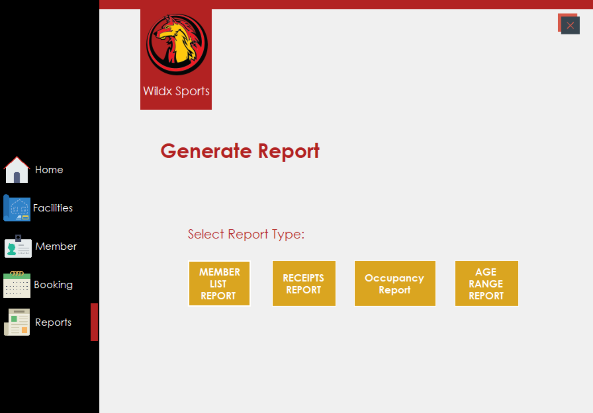

#PROJECT DETAILS

- built for receptionists
- aimed to improve booking process
- a group project developed by three members
- Windows Form project using C#, .NET Framework, Entity Framework, Crystal Report

## Sample Screens

### HOME PAGE

### MEMBER LIST PAGE

### EDIT MEMBER PAGE
    Authorised person can add, edit or delete information of customers.

### SEARCH FACILITY PAGE
    Authorised person can search by specific criteria.

### BOOKING PAGE
    Authorised person can book by selecting all required information.
    If the time slot is already occupied, the button color will be red.

### REPORT MENU PAGE
    Authorised person can view reports.

    After clicking each button, related report will be shown in a new form.